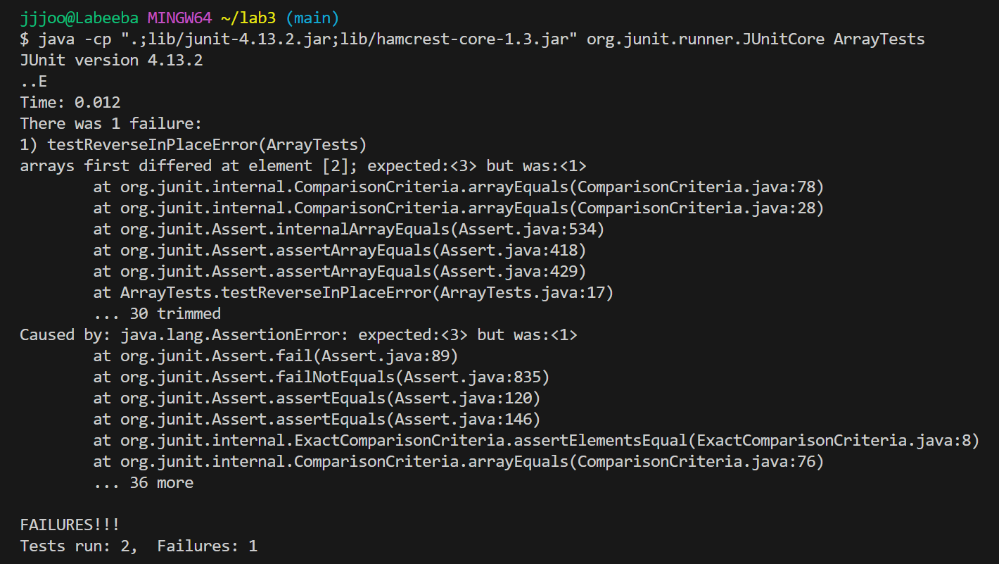

#Part 1

A failure-inducing input for the buggy program:
~~~
  @Test
  public void testReverseInPlaceError()
  {
    int[] input1 = { 3,2,1 };
    ArrayExamples.reverseInPlace(input1);
    assertArrayEquals(new int[]{ 1,2,3 }, input1);
  }
~~~
An input that doesn’t induce a failure:
~~~
  @Test
  public void testReverseInPlaceNoError()
  {
    int[] input1 = { 1 };
    ArrayExamples.reverseInPlace(input1);
    assertArrayEquals(new int[]{ 1 }, input1);
  }
~~~
The symptom, as the output of running the tests:

Note: the output array is {1,2,1}

The bug, as the before-and-after code change required to fix it:

Before:
~~~
  static void reverseInPlace(int[] arr) {
    for(int i = 0; i < arr.length; i += 1) {
      arr[i] = arr[arr.length - i - 1];
    }
  }
~~~
After:
~~~
  static void reverseInPlace(int[] arr) {
    for(int i = 0; i < arr.length/2; i += 1) {
      int temp = arr[i];
      arr[i] = arr[arr.length - i - 1];
      arr[arr.length - i - 1] = temp;
      
    }
  }
~~~
The issue with the code is that it reverses half the elements, then, when it gets past the middle element, it replaces the elements with those it originally replaced in the first half. For example, the array {1,2,3}, would become {3,2,3}.
The fix is that we divide the length of the for loop to half the array's length, then switch between the value at index i with the one on the opposite side at arr.length - i - 1. We do this by saving arr[i] to a temporary variable then when we reassign it we replace arr[arr.length - i - 1] with temp. 

#Part 2
command grep
-r: searches recursively within the files. This is useful because it lets us search within the text files for the strings we are looking for. for example, I search for the string "loud" in the file plos:
~~~
grep -r "loud" technical/plos
technical/plos/journal.pbio.0020101.txt:        experimentation. Yet, the main two points of this discovery are loud and clear: social
technical/plos/journal.pbio.0020262.txt:        loudly and clearly: there is much more genetic variation within any village on earth than
technical/plos/journal.pbio.0020337.txt:        his ear after inducing temporary tinnitus with overly loud sound. The technology wasn't up
technical/plos/pmed.0020194.txt:        Exposure to short periods of very loud noise can cause tinnitus—a persistent ringing or
technical/plos/pmed.0020206.txt:        autonomy cloud their ability to assess the impressive benefits these groups provide.
technical/plos/pmed.0020212.txt:        clouded by Type 1 and Type 2 error. Schizophrenia is similar to other complex traits: it is
~~~
and here searching for "sword" in the same file:
~~~
grep -r "sword" technical/plos
technical/plos/journal.pbio.0020113.txt:        and wolf populations brought to the brink of extinction swordfish and sharks are the
technical/plos/pmed.0020007.txt:        could possibly be the problem with older adults spending their time doing crossword puzzles
technical/plos/pmed.0020206.txt:        has developed a password-protected Web site, PatientWeb (https://fisher.mgh.harvard.edu/),
~~~

-l: prints a file name if a match is found within the file. This is helpful because we can determine what files contain the information we need.
using it with -r on the string "loud":
~~~
grep -r -l "loud" technical/plos
technical/plos/journal.pbio.0020101.txt
technical/plos/journal.pbio.0020262.txt
technical/plos/journal.pbio.0020337.txt
technical/plos/pmed.0020194.txt
technical/plos/pmed.0020206.txt
technical/plos/pmed.0020212.txt

~~~
one the string "sword":
~~~
grep -r -l "sword" technical/plos
technical/plos/journal.pbio.0020113.txt
technical/plos/pmed.0020007.txt
technical/plos/pmed.0020206.txt
~~~

-o: only prints the string we are looking for. This is helpful because it is less crowded and easier to read, while still making sure that the string we need is indeed in the file.
example with "loud" and -r:
~~~
$ grep -r -o "loud" technical/plos
technical/plos/journal.pbio.0020101.txt:loud
technical/plos/journal.pbio.0020262.txt:loud
technical/plos/journal.pbio.0020337.txt:loud
technical/plos/pmed.0020194.txt:loud
technical/plos/pmed.0020206.txt:loud
technical/plos/pmed.0020212.txt:loud
~~~
example with sword
~~~
$ grep -r -o "sword" technical/plos
technical/plos/journal.pbio.0020113.txt:sword
technical/plos/pmed.0020007.txt:sword
technical/plos/pmed.0020206.txt:sword
~~~

-n: displays the line number of each result. This is helpful because it can help us locate our information more easily.
example with "loud" and -r"
~~~
$ grep -r -n "loud" technical/plos
technical/plos/journal.pbio.0020101.txt:150:        experimentation. Yet, the main two points of this discovery are loud and clear: social
technical/plos/journal.pbio.0020262.txt:48:        loudly and clearly: there is much more genetic variation within any village on earth than
technical/plos/journal.pbio.0020337.txt:61:        his ear after inducing temporary tinnitus with overly loud sound. The technology wasn't up
technical/plos/pmed.0020194.txt:6:        Exposure to short periods of very loud noise can cause tinnitus—a persistent ringing or
technical/plos/pmed.0020206.txt:156:        autonomy cloud their ability to assess the impressive benefits these groups provide.
technical/plos/pmed.0020212.txt:171:        clouded by Type 1 and Type 2 error. Schizophrenia is similar to other complex traits: it is
~~~
example with "sword":
~~~
$ grep -r -n "sword" technical/plos
technical/plos/journal.pbio.0020113.txt:10:        and wolf populations brought to the brink of extinction swordfish and sharks are the
technical/plos/pmed.0020007.txt:9:        could possibly be the problem with older adults spending their time doing crossword puzzles
technical/plos/pmed.0020206.txt:141:        has developed a password-protected Web site, PatientWeb (https://fisher.mgh.harvard.edu/),
~~~

